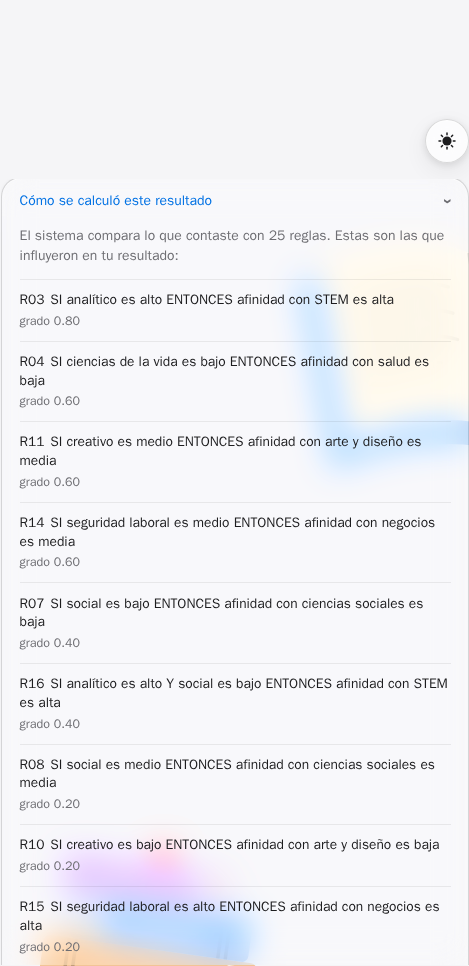

# Informe — Rumbo: chatbot de orientación vocacional con SED

Materia: Desarrollo de sistemas basados en conocimientos.
Modalidad elegida: chatbot inteligente con estructura de Sistema Experto
Difuso (diagnóstico de afinidad vocacional). Repositorio:
<https://github.com/matiasm011/rumbo>.

## 1. Objetivo

Probar cómo funciona un sistema experto en combinación con lógica difusa:
el chatbot conversa con el estudiante para adquirir hechos, y un SED Mamdani
de 25 reglas dictamina la afinidad hacia 5 áreas vocacionales.

## 2. Arquitectura y plataforma

Se desarrolló software propio (plataforma a criterio) en lugar de usar
Watson/Dialogflow, para que el sistema sea local, reproducible y sin
dependencias de trials comerciales:

- **Backend:** FastAPI (Python). Endpoints del motor sin chat:
  `GET /api/reglas`, `POST /api/inferir`.
- **SED:** `scikit-fuzzy` (`backend/app/motor_difuso.py`,
  `backend/app/reglas.py`). Es lo único que decide el dictamen.
- **Chat:** diálogo por turnos con NLU heurística (detección de tema,
  saludos, actos sociales) y memoria por sesión.
- **LLM local opcional:** Ollama con `llama3.2:3b`, servido por Docker.
  Solo redacta respuestas breves a partir de una guía determinística;
  si no está disponible, el chat responde con textos guía y el dictamen
  es idéntico.
- **Despliegue:** `docker compose up --build` (CPU en cualquier PC;
  `docker-compose.gpu.yml` como opción para NVIDIA).

Flujo de un turno: mensaje → NLU → diálogo (guía) → LLM redacta →
respuesta. La escala del 1 al 10 es la única que registra hechos: la
charla orienta, el número confirma.

## 3. Base de conocimiento

**Entradas (hechos crisp 0–10):** analítico, social, creativo,
ciencias de la vida, seguridad laboral.

**Términos lingüísticos:** bajo, medio, alto, con triangulares solapadas
`bajo [0,0,5]`, `medio [2.5,5,7.5]`, `alto [5,10,10]`.

**Salidas (afinidad 0–10):** STEM, salud, ciencias sociales, arte y
diseño, negocios, con los mismos tres términos.

## 4. Motor de inferencia y reglas

Motor **Mamdani**: AND del antecedente por mínimo, implicación por
mínimo, agregación por máximo y defuzzificación por centroide. Se eligió
porque produce salidas difusas interpretables por área, adecuadas para un
diagnóstico con traza explicable.

25 reglas de producción (mínimo exigido: 20). R01–R15 dan cobertura total
(3 por área); R16–R25 combinan 2–3 condiciones para refinar el dictamen:

| ID | Regla |
|----|-------|
| R01 | SI analítico es bajo ENTONCES afinidad con STEM es baja |
| R02 | SI analítico es medio ENTONCES afinidad con STEM es media |
| R03 | SI analítico es alto ENTONCES afinidad con STEM es alta |
| R04 | SI ciencias de la vida es bajo ENTONCES afinidad con salud es baja |
| R05 | SI ciencias de la vida es medio ENTONCES afinidad con salud es media |
| R06 | SI ciencias de la vida es alto ENTONCES afinidad con salud es alta |
| R07 | SI social es bajo ENTONCES afinidad con ciencias sociales es baja |
| R08 | SI social es medio ENTONCES afinidad con ciencias sociales es media |
| R09 | SI social es alto ENTONCES afinidad con ciencias sociales es alta |
| R10 | SI creativo es bajo ENTONCES afinidad con arte y diseño es baja |
| R11 | SI creativo es medio ENTONCES afinidad con arte y diseño es media |
| R12 | SI creativo es alto ENTONCES afinidad con arte y diseño es alta |
| R13 | SI seguridad laboral es bajo ENTONCES afinidad con negocios es baja |
| R14 | SI seguridad laboral es medio ENTONCES afinidad con negocios es media |
| R15 | SI seguridad laboral es alto ENTONCES afinidad con negocios es alta |
| R16 | SI analítico es alto Y social es bajo ENTONCES afinidad con STEM es alta |
| R17 | SI analítico es alto Y creativo es bajo ENTONCES afinidad con STEM es alta |
| R18 | SI ciencias de la vida es alto Y social es alto ENTONCES afinidad con salud es alta |
| R19 | SI ciencias de la vida es alto Y analítico es medio ENTONCES afinidad con salud es alta |
| R20 | SI social es alto Y analítico es bajo Y ciencias de la vida es bajo ENTONCES afinidad con ciencias sociales es alta |
| R21 | SI social es alto Y creativo es medio ENTONCES afinidad con ciencias sociales es alta |
| R22 | SI creativo es alto Y analítico es bajo ENTONCES afinidad con arte y diseño es alta |
| R23 | SI creativo es alto Y seguridad laboral es bajo ENTONCES afinidad con arte y diseño es alta |
| R24 | SI seguridad laboral es alto Y analítico es medio Y social es medio ENTONCES afinidad con negocios es alta |
| R25 | SI seguridad laboral es alto Y ciencias de la vida es bajo Y creativo es bajo ENTONCES afinidad con negocios es alta |

**Traza:** una regla dispara si su grado (mínimo de pertenencias del
antecedente) supera 0.01. El dictamen informa el área principal (afinidad
máxima), las 5 afinidades, las reglas disparadas ordenadas por grado y
carreras ilustrativas. No hay reglas contradictorias (mismo antecedente,
distinto consecuente).

## 5. Pruebas del motor

Un perfil arquetípico por área produce su área como ganadora:

| Perfil (ana, soc, cre, vida, seg) | Gana | Afinidades (STEM, salud, sociales, arte, negocios) |
|---|---|---|
| 9.5, 1.5, 2.0, 1.0, 6.0 | STEM | 8.3, 1.7, 1.8, 1.9, 5.8 |
| 6.0, 8.5, 3.0, 9.5, 7.0 | Salud | 5.8, 8.3, 8.2, 3.0, 7.0 |
| 2.0, 9.5, 6.0, 2.0, 4.0 | Sociales | 1.9, 1.9, 8.3, 5.8, 4.2 |
| 2.0, 4.0, 9.5, 1.5, 2.0 | Arte | 1.9, 1.8, 4.2, 8.3, 1.9 |
| 6.0, 6.0, 2.0, 1.5, 9.5 | Negocios | 5.8, 1.8, 5.8, 1.9, 8.3 |

Casos borde (todo 0, todo 10) no rompen y disparan reglas. La suite
`pytest` (72 pruebas) cubre motor, diálogo, NLU y API.

## 6. El bot en funcionamiento

Inicio: saludo y primera pregunta del perfil.


Conversación con repregunta generativa y escala interactiva del 1 al 10,
que es lo único que registra el hecho.


Dictamen completo: carreras del área principal, hechos confirmados y
afinidades por área.


Traza explicable: cada dictamen lista las reglas disparadas y su grado.



## 7. Cómo reproducirlo

```bash
git clone https://github.com/matiasm011/rumbo.git
cd rumbo
docker compose up --build
```

Abrir <http://localhost:8000>. La primera vez se baja el modelo
`llama3.2:3b` (~2 GB) en segundo plano; mientras tanto la app responde
con textos guía y el dictamen funciona igual. Detalles en `README.md`.

## 8. Conclusiones

- El SED decide y el LLM redacta: la separación permitió probar la
  combinación SE + lógica difusa sin que el modelo invente resultados.
- 25 reglas con cobertura total, sin contradicciones, con traza visible.
- El sistema degrada con gracia: sin GPU responde más lento, sin Ollama
  responde con guías, y el dictamen nunca depende del LLM.
